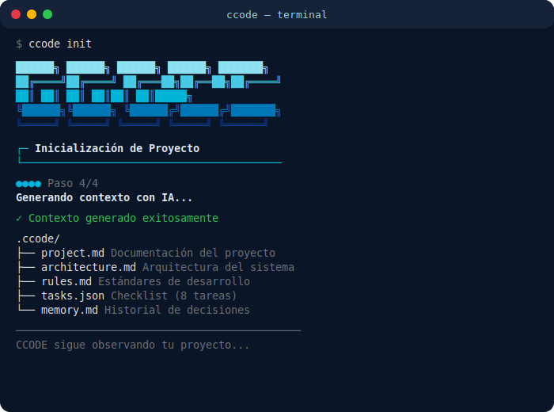
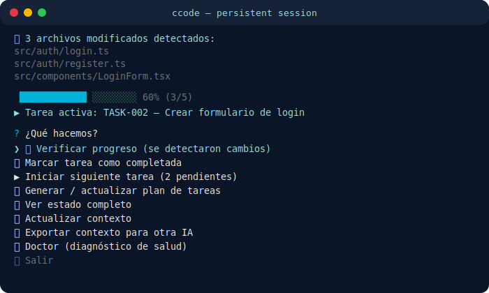
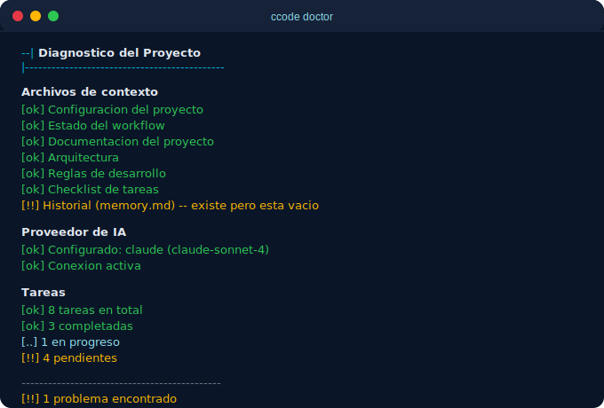

<div align="center">


<br/>
<br/>

**Persistent context CLI for AI-assisted development.**

Stop re-explaining your project to AI every time the session resets.

<br/>

```bash
npm install -g @korl3one/ccode
```

<br/>

[](https://www.npmjs.com/package/@korl3one/ccode)
[](LICENSE)
[](https://nodejs.org)
[](https://github.com/iDevelop25/ccode)

</div>

---

## The problem

Every time you switch sessions, models, or tools when working with AI, **you lose your project context**. You end up re-explaining the architecture, previous decisions, and current state over and over again.

## The solution

CCODE stores your project context **inside the repository**. One command generates professional documentation, architecture, rules, and a verifiable task checklist — all adapted to your project's actual complexity.

Any developer or AI can read `.ccode/` and understand the project instantly.

---

## Demo

### `ccode init` — Generate full project context

<div align="center">

</div>

<br/>

### Persistent session — CCODE watches while you code

<div align="center">

</div>

<br/>

### `ccode doctor` — Project health check

<div align="center">

</div>

---

## Why CCODE?

<div align="center">

| | CCODE | Manual prompts |
|---|:---:|:---:|
| Persistent project context | ✅ | ❌ |
| Architecture adapted to complexity | ✅ | ❌ |
| AI-ready documentation | ✅ | ❌ |
| Verifiable task checklist | ✅ | ❌ |
| Auto-detect file changes | ✅ | ❌ |
| AI-powered task verification | ✅ | ❌ |
| Works with 6 AI providers | ✅ | ❌ |
| Context lives in the repo (Git) | ✅ | ❌ |

</div>

---

## How it works

### 1. Initialize

```bash
cd my-project
ccode init
```

A step-by-step wizard asks about your project and an AI generates the full context. CCODE **adapts automatically**:

| Project type | Context depth | Tasks |
|---|---|---|
| Simple (prototype, few features) | Lightweight docs | 3-5 |
| Medium (standard app) | Moderate architecture | 5-8 |
| Complex (multiple modules) | Detailed patterns + diagrams | 8-12 |

A simple login doesn't need microservice diagrams. CCODE is smart about it.

### 2. Persistent session

After init, CCODE **stays active** — watching your project in real time:

- Detects file changes automatically
- Suggests verifying tasks when it sees progress
- Adapts the menu to your current workflow state
- Recovers from errors without crashing

You code in your editor. CCODE runs in another terminal as a companion.

### 3. AI verification

CCODE compares **acceptance criteria** against **actual project files**:

```
✓ TASK-001: Setup project base — COMPLETED
  Evidence: package.json, tsconfig.json found

◐ TASK-002: Create login form — IN PROGRESS
  Missing: password field not found, validation pending

○ TASK-003: Implement JWT auth — PENDING
```

It doesn't guess — it verifies.

### 4. Context export

```bash
ccode export
```

Generates a single `.md` file with your full project context — ready to paste into **any AI chat** (ChatGPT, Claude, Gemini) without connecting an API.

### 5. Project health check

```bash
ccode doctor
```

Like a linter, but for your project context. Checks files, AI connection, task status, and tells you what needs attention.

---

## Supported AI Providers

<div align="center">

| Provider | Models | Note |
|----------|--------|------|
| **Claude** (Anthropic) | Sonnet 4, Haiku 3.5, Opus 4 | Recommended |
| **OpenAI** (ChatGPT) | GPT-4o, GPT-4o mini, GPT-4.1, o3-mini | Most popular |
| **Google Gemini** | 2.5 Flash, 2.5 Pro, 2.0 Flash | Free tier available |
| **DeepSeek** | Chat, Reasoner | Budget-friendly |
| **Groq** | Llama 3.3 70B, Llama 3.1 8B, Mixtral | Ultra-fast, free tier |
| **Ollama** | Any local model | Offline, no API key |

</div>

---

## Available commands

| Command | What it does |
|---------|-------------|
| `ccode init` | Interactive wizard — generates full project context |
| `ccode update` | Re-analyze project and refresh context with AI |
| `ccode export` | Export context as a single `.md` for any AI chat |
| `ccode explain` | Quick project summary for onboarding |
| `ccode doctor` | Health check — what's good, what's missing |
| `ccode connect` | Configure AI provider and model |
| `ccode status` | Dashboard with progress bar and stats |
| `ccode verify` | AI-powered task verification |

---

## What gets generated

Everything lives in `.ccode/` inside your repository:

```
.ccode/
├── project.md          Vision, objectives, scope
├── architecture.md     System structure (adapted to complexity)
├── rules.md            Development standards for your stack
├── tasks.json          Task checklist with acceptance criteria
├── state.json          Active task, workflow stage
├── context.json        Project configuration
├── memory.md           Decision history
└── config.json         AI provider config
```

---

## Architecture

```
src/
├── cli/           Session, branding, file watcher
├── core/          Context engine, tasks, prompt builder
├── ai/            6 provider adapters (Adapter pattern)
└── utils/         File system abstraction
```

**Patterns:** Adapter (AI providers) · Observer (file watcher) · State Machine (workflow) · Builder (prompts)

---

## Contributing

See [CONTRIBUTING.md](CONTRIBUTING.md) for setup instructions.

Adding a new AI provider? Just implement `IAIProvider`, add it to the manager switch, done. Zero changes to the rest of the system.

---

## Learn more

| Resource | Link |
|----------|------|
| Learning guide (6 modules, QP2C) | [docs/learning/](docs/learning/README.md) |
| Engineering roles | [AGENTS.md](AGENTS.md) |
| Technical competencies | [SKILLS.md](SKILLS.md) |
| YouTube tutorials | [@CreativeCode25](https://www.youtube.com/@CreativeCode25) |

---

<div align="center">

### If CCODE helps you, consider giving it a star ⭐

It helps the project grow and reach more developers.

<br/>

[](https://github.com/iDevelop25/ccode)

<br/>

**[npm](https://www.npmjs.com/package/@korl3one/ccode)** · **[GitHub](https://github.com/iDevelop25/ccode)** · **[YouTube](https://www.youtube.com/@CreativeCode25)**

<br/>

*CCODE doesn't tell you how to code — it tells you what to build and makes sure you don't lose track.*

</div>
